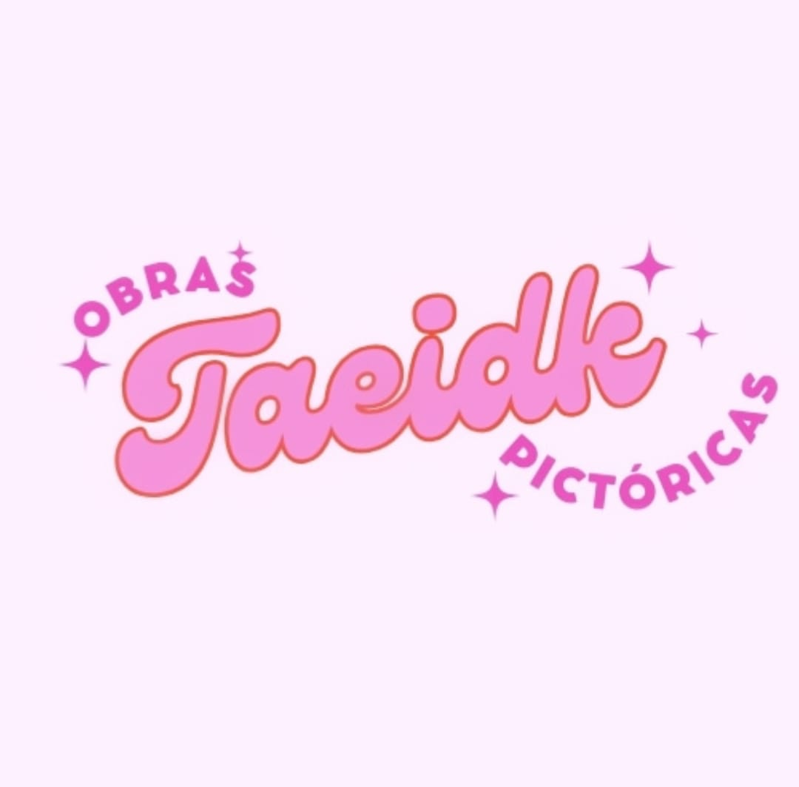
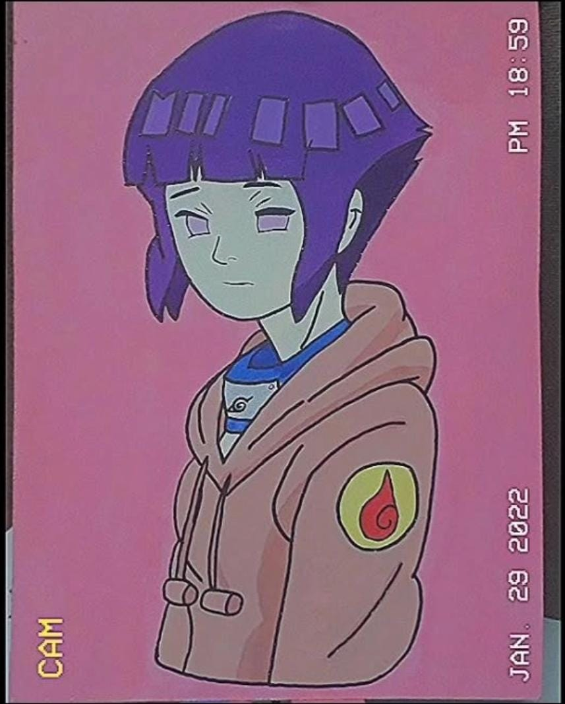
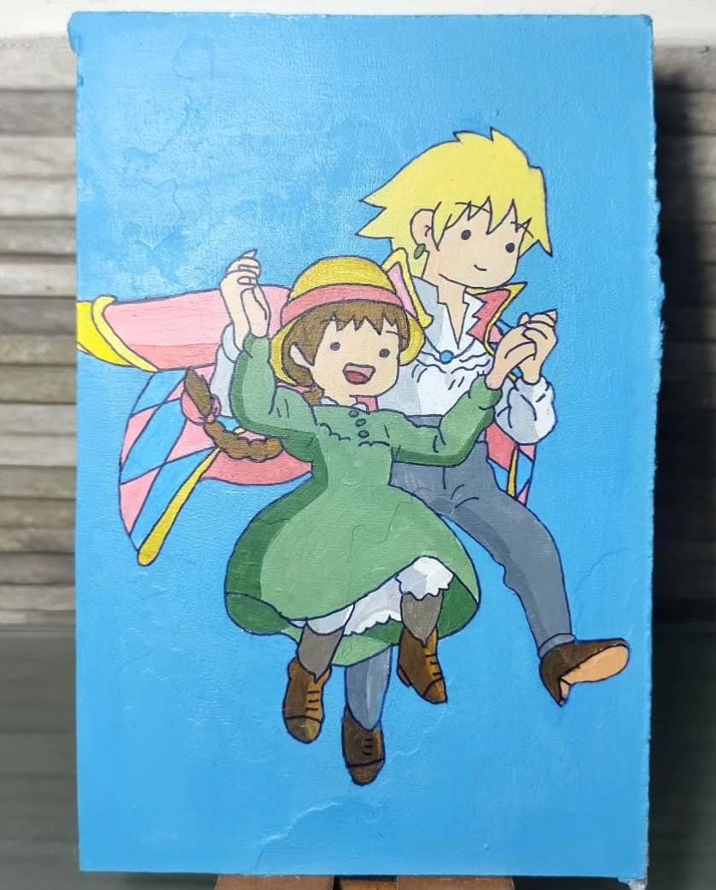
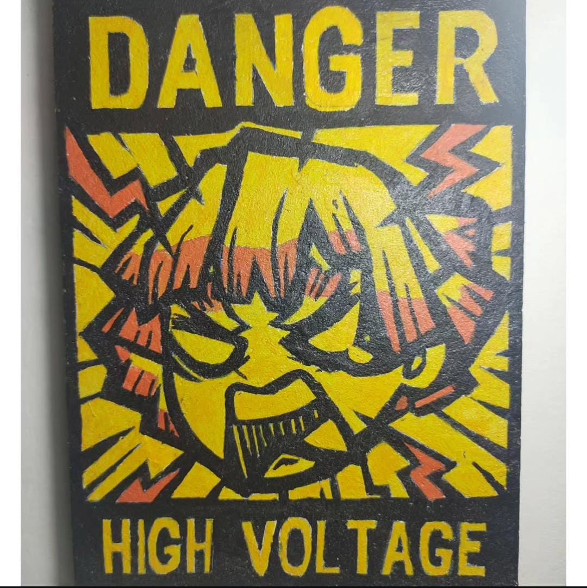

<!DOCTYPE html>
<html lang="es">
<head>
  <meta charset="UTF-8">
  <title>Taeidk</title>
  
</head>
<body>

  <header>
    
    <h1>Taeidk</h1>
    <nav>
      <a href="#inicio">Inicio</a>
      <a href="#contacto">Contacto</a>
    </nav>
  </header>

  <section id="inicio" class="productos">

    <!-- PRODUCTOS EXISTENTES A PARTIR DE AQUÍ -->
    <!-- (Ya están: Luffy, Barco los simpsons, Boyfriends, Gary) -->

    <!-- PRODUCTO: Charlie y Nick -->
    

      
      <h3>Charlie y Nick "Heartstopper"</h3>
      
Cada cuadro está hecho a mano desde 0, el tiempo de realización depende de los detalles y tamaños. El tiempo mínimo son dos semanas, puede ser más como menos dependiendo del cuadro.

      <label for="tamano-charlie">Tamaño:</label>
      <select id="tamano-charlie">
        <option value="20x15">$10.000 - 20x15</option>
        <option value="20x20">$12.500 - 20x20</option>
        <option value="28x23">$14.000 - 28x23</option>
        <option value="30x20">$16.500 - 30x20</option>
        <option value="30x30">$18.000 - 30x30</option>
        <option value="35x25">$20.500 - 35x25</option>
      </select>
       
      <button onclick="comprar('Charlie y Nick Heartstopper', 'tamano-charlie')">Comprar por WhatsApp</button>
    

    <!-- PRODUCTO: Finn y Jake -->
    

      
      <h3>Finn y Jake "Hora de aventura"</h3>
      
Cada cuadro está hecho a mano desde 0, el tiempo de realización depende de los detalles y tamaños. El tiempo mínimo son dos semanas, puede ser más como menos dependiendo del cuadro.

      <label for="tamano-finn">Tamaño:</label>
      <select id="tamano-finn">
        <option value="20x15">$10.000 - 20x15</option>
        <option value="20x20">$12.500 - 20x20</option>
        <option value="28x23">$14.000 - 28x23</option>
        <option value="30x20">$16.500 - 30x20</option>
        <option value="30x30">$18.000 - 30x30</option>
        <option value="35x25">$20.500 - 35x25</option>
      </select>
       
      <button onclick="comprar('Finn y Jake Hora de aventura', 'tamano-finn')">Comprar por WhatsApp</button>
    

    <!-- PRODUCTO: Hinata -->
    

      
      <h3>Hinata "Naruto"</h3>
      
Cada cuadro está hecho a mano desde 0, el tiempo de realización depende de los detalles y tamaños. El tiempo mínimo son dos semanas, puede ser más como menos dependiendo del cuadro.

      <label for="tamano-hinata">Tamaño:</label>
      <select id="tamano-hinata">
        <option value="20x15">$10.000 - 20x15</option>
        <option value="20x20">$12.500 - 20x20</option>
        <option value="28x23">$14.000 - 28x23</option>
        <option value="30x20">$16.500 - 30x20</option>
        <option value="30x30">$18.000 - 30x30</option>
        <option value="35x25">$20.500 - 35x25</option>
      </select>
       
      <button onclick="comprar('Hinata Naruto', 'tamano-hinata')">Comprar por WhatsApp</button>
    

    <!-- PRODUCTO: Howl -->
    

      
      <h3>Howl "El castillo ambulante"</h3>
      
Cada cuadro está hecho a mano desde 0, el tiempo de realización depende de los detalles y tamaños. El tiempo mínimo son dos semanas, puede ser más como menos dependiendo del cuadro.

      <label for="tamano-howl">Tamaño:</label>
      <select id="tamano-howl">
        <option value="20x15">$10.000 - 20x15</option>
        <option value="20x20">$12.500 - 20x20</option>
        <option value="28x23">$14.000 - 28x23</option>
        <option value="30x20">$16.500 - 30x20</option>
        <option value="30x30">$18.000 - 30x30</option>
        <option value="35x25">$20.500 - 35x25</option>
      </select>
       
      <button onclick="comprar('Howl El castillo ambulante', 'tamano-howl')">Comprar por WhatsApp</button>
    

    <!-- PRODUCTO: Otho Ai -->
    

      
      <h3>Otho Ai "Wonder egg priority"</h3>
      
Cada cuadro está hecho a mano desde 0, el tiempo de realización depende de los detalles y tamaños. El tiempo mínimo son dos semanas, puede ser más como menos dependiendo del cuadro.

      <label for="tamano-otho">Tamaño:</label>
      <select id="tamano-otho">
        <option value="20x15">$10.000 - 20x15</option>
        <option value="20x20">$12.500 - 20x20</option>
        <option value="28x23">$14.000 - 28x23</option>
        <option value="30x20">$16.500 - 30x20</option>
        <option value="30x30">$18.000 - 30x30</option>
        <option value="35x25">$20.500 - 35x25</option>
      </select>
       
      <button onclick="comprar('Otho Ai Wonder egg priority', 'tamano-otho')">Comprar por WhatsApp</button>
    

    <!-- PRODUCTO: Reki y Langa -->
    

      
      <h3>Reki y Langa "SK8"</h3>
      
Cada cuadro está hecho a mano desde 0, el tiempo de realización depende de los detalles y tamaños. El tiempo mínimo son dos semanas, puede ser más como menos dependiendo del cuadro.

      <label for="tamano-reki">Tamaño:</label>
      <select id="tamano-reki">
        <option value="20x15">$10.000 - 20x15</option>
        <option value="20x20">$12.500 - 20x20</option>
        <option value="28x23">$14.000 - 28x23</option>
        <option value="30x20">$16.500 - 30x20</option>
        <option value="30x30">$18.000 - 30x30</option>
        <option value="35x25">$20.500 - 35x25</option>
      </select>
       
      <button onclick="comprar('Reki y Langa SK8', 'tamano-reki')">Comprar por WhatsApp</button>
    

    <!-- PRODUCTO: Rock Lee -->
    

      
      <h3>Rock Lee "Naruto"</h3>
      
Cada cuadro está hecho a mano desde 0, el tiempo de realización depende de los detalles y tamaños. El tiempo mínimo son dos semanas, puede ser más como menos dependiendo del cuadro.

      <label for="tamano-rock">Tamaño:</label>
      <select id="tamano-rock">
        <option value="20x15">$10.000 - 20x15</option>
        <option value="20x20">$12.500 - 20x20</option>
        <option value="28x23">$14.000 - 28x23</option>
        <option value="30x20">$16.500 - 30x20</option>
        <option value="30x30">$18.000 - 30x30</option>
        <option value="35x25">$20.500 - 35x25</option>
      </select>
       
      <button onclick="comprar('Rock Lee Naruto', 'tamano-rock')">Comprar por WhatsApp</button>
    

    <!-- PRODUCTO: The Promised Neverland -->
    

      
      <h3>The Promised Neverland</h3>
      
Cada cuadro está hecho a mano desde 0, el tiempo de realización depende de los detalles y tamaños. El tiempo mínimo son dos semanas, puede ser más como menos dependiendo del cuadro.

      <label for="tamano-neverland">Tamaño:</label>
      <select id="tamano-neverland">
        <option value="20x15">$10.000 - 20x15</option>
        <option value="20x20">$12.500 - 20x20</option>
        <option value="28x23">$14.000 - 28x23</option>
        <option value="30x20">$16.500 - 30x20</option>
        <option value="30x30">$18.000 - 30x30</option>
        <option value="35x25">$20.500 - 35x25</option>
      </select>
       
      <button onclick="comprar('The Promised Neverland', 'tamano-neverland')">Comprar por WhatsApp</button>
    

    <!-- PRODUCTO: Zenitsu -->
    

      
      <h3>Zenitsu Danger "Kimetsu no Yaiba"</h3>
      
Cada cuadro está hecho a mano desde 0, el tiempo de realización depende de los detalles y tamaños. El tiempo mínimo son dos semanas, puede ser más como menos dependiendo del cuadro.

      <label for="tamano-zenitsu">Tamaño:</label>
      <select id="tamano-zenitsu">
        <option value="20x15">$10.000 - 20x15</option>
        <option value="20x20">$12.500 - 20x20</option>
        <option value="28x23">$14.000 - 28x23</option>
        <option value="30x20">$16.500 - 30x20</option>
        <option value="30x30">$18.000 - 30x30</option>
        <option value="35x25">$20.500 - 35x25</option>
      </select>
       
      <button onclick="comprar('Zenitsu Danger Kimetsu no Yaiba', 'tamano-zenitsu')">Comprar por WhatsApp</button>
    

  </section>

  <section id="contacto" style="text-align:center; padding: 20px;">
    <h2>Contacto</h2>
    
¿Querés una obra personalizada o tenés alguna consulta?

    
Escribime a: <a href="mailto:nadine.anahi95@gmail.com">nadine.anahi95@gmail.com</a>

  </section>

  <footer>
    
&copy; 2025 Taeidk - Todas las obras con amor 🎨💖

  </footer>

  

</body>
</html>
